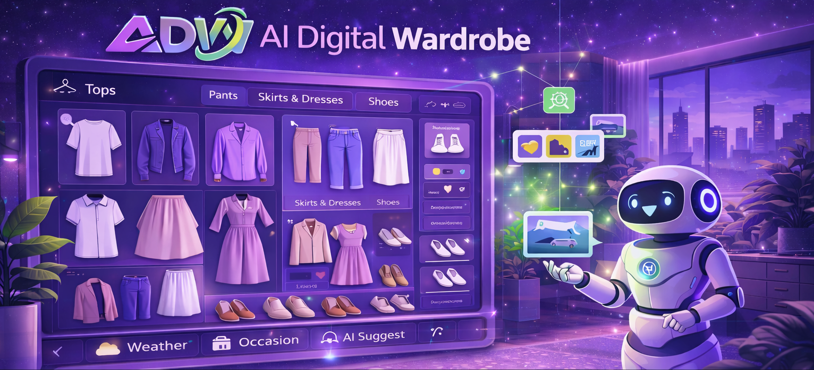

<p align="center">
  <br>
  
</p>

<p align="center">
  An AI-powered digital wardrobe platform that helps users digitize personal clothing items, manage wardrobe inventories, and receive context-aware styling suggestions based on their wardrobe, body profile, and everyday use cases.
</p>

<p align="center">
  <a href="#-quick-start"><strong>Get Started »</strong></a>
  <br/>
  <br/>
  <a href="#-features">✨ Features</a>
  |
  <a href="#-system-architecture">🏗️ Architecture</a>
  |
  <a href="#-project-structure">📦 Project Structure</a>
  |
  <a href="#-environment-variables">🔐 Environment</a>
  |
  <a href="#-license">📄 License</a>
</p>

<p align="center">
  
  
  
  
  
  
</p>

---

## 📚 Table of Contents

- [✨ Overview](#-overview)
- [🌟 Why this project matters](#-why-this-project-matters)
- [🚀 Features](#-features)
- [🧠 AI Pipeline](#-ai-pipeline)
- [🛠️ Tech Stack](#-tech-stack)
- [🏗️ System Architecture](#-system-architecture)
- [📦 Project Structure](#-project-structure)
- [⚙️ How the system works](#-how-the-system-works)
- [🚀 Quick Start](#-quick-start)
- [⬇️ Download MobileSAM Checkpoint](#%EF%B8%8F-download-mobilesam-checkpoint)
- [🔐 Environment Variables](#-environment-variables)
- [🐳 Run with Docker Compose](#-run-with-docker-compose)
- [💻 Run locally without Docker](#-run-locally-without-docker)
- [📡 Important API Routes](#-important-api-routes)
- [🧪 Example User Flows](#-example-user-flows)
- [📌 Project Status](#-project-status)
- [🤝 Contributing](#-contributing)
- [📄 License](#-license)
- [🙌 Acknowledgements](#-acknowledgements)

---

## ✨ Overview

**AI Digital Wardrobe** is a full-stack fashion technology platform designed to make wardrobe management smarter, more visual, and more practical in daily life.

Instead of treating clothing as static photos in a gallery, the system transforms a personal wardrobe into structured digital data. Users can upload clothing images, extract individual items with AI-powered segmentation, organize them into categories, and receive outfit suggestions tailored to different contexts such as school, work, dating, traveling, or special events.

The project combines:

- **Computer vision** for clothing extraction and classification
- **Generative AI** for styling guidance and outfit recommendation
- **User profile intelligence** for body-aware personalization
- **Cloud-based persistence** for wardrobe, account, and conversation history management

---

## 🌟 Why this project matters

Choosing clothes is a repeated daily decision. Most users already own enough items, but still struggle to:

- remember what they actually have
- combine pieces effectively
- dress appropriately for a situation
- make better use of existing clothes before buying more

AI Digital Wardrobe addresses that gap by combining wardrobe data, body profile information, and AI-assisted fashion support in one unified platform.

---

## 🚀 Features

### 1. Digital wardrobe management

- Upload clothing images directly from the browser
- Extract single garments from source images
- Save wardrobe items to the user account
- Browse wardrobe items in a categorized visual layout
- Delete items that are no longer needed

### 2. AI-powered clothing parsing

- Image cutout service built with **FastAPI**
- Supports **MobileSAM**-based segmentation
- Falls back to **GrabCut / automatic masking** when prompt-based segmentation is unavailable
- Returns clean PNG cutouts and optional mask metadata
- Auto-labels items into categories such as:
  - Tops
  - Pants
  - Skirts
  - Dresses
  - Shoes
  - Others

### 3. Smart outfit suggestion

- AI stylist chat for natural fashion interaction
- Outfit recommendations based on:
  - occasion
  - destination
  - weather
  - style preference
  - selected wardrobe items
  - user body profile
- Supports both:
  - conversational fashion assistance
  - structured outfit generation flow
- Can generate accompanying visual outfit output through an external image generation pipeline

### 4. Personalized onboarding

Users can provide body-related information to improve recommendation quality:

- gender
- age
- height
- weight
- bust
- waist
- hip

This enables more realistic and context-aware styling suggestions.

### 5. Authentication and account system

- Email/password authentication
- Google sign-in
- Firebase-backed account and session handling
- User profile persistence in Firestore
- Support utilities for account synchronization flows

### 6. Forgot password via email verification

- Username-based password reset flow
- Secure 6-digit verification code
- Expiration handling
- Wrong-attempt limiting
- Password update through Firebase Admin
- Email delivery via SMTP/Nodemailer

### 7. Chat history persistence

- Stores conversation history per user
- Supports conversation titles, timestamps, and image references
- Keeps wardrobe stylist interactions reusable across sessions

### 8. VIP subscription flow

- Free and VIP plans
- VIP monthly plan
- Manual payment confirmation flow
- Admin approval workflow
- VIP expiration management
- Different outfit-generation limits by plan

---

## 🧠 AI Pipeline

### Clothing parsing flow

1. The user uploads a clothing image
2. The web app sends the image to the AI service
3. The AI service performs segmentation using:
   - **MobileSAM**
   - or fallback **GrabCut**
4. The cutout image is converted into PNG
5. Auto-labeling predicts the garment category with **CLIP**
6. The web app allows the user to review and confirm the result
7. The final wardrobe item is stored in cloud storage and database

### Outfit recommendation flow

1. The user opens the wardrobe stylist
2. The user sends a fashion request in natural language
3. The system checks context and user profile
4. Gemini-based logic determines whether the request is:
   - a general chat request
   - or an outfit generation request
5. Selected wardrobe items are analyzed
6. A styling note and outfit suggestion are returned
7. An optional generated outfit image can be produced through the generation pipeline

---

## 🛠️ Tech Stack

### Frontend

- **Next.js 16**
- **React 19**
- **TypeScript**
- **Tailwind CSS 4**
- **React Icons**

### Backend / AI Service

- **FastAPI**
- **Uvicorn**
- **Python 3.10**
- **OpenCV**
- **Pillow**
- **NumPy**
- **PyTorch**

### AI / ML

- **MobileSAM** for interactive segmentation
- **GrabCut fallback** for automatic cutout
- **open_clip_torch / CLIP** for garment category prediction
- **Gemini** for stylist intelligence and structured outfit reasoning
- External image generation API for visual outfit rendering

### Platform Services

- **Firebase Auth**
- **Firestore**
- **Firebase Storage**
- **Firebase Admin SDK**
- **Cloudinary**
- **Nodemailer**
- **Docker Compose**

---

## 🏗️ System Architecture

```text
┌───────────────────────────────────────────────────────────────┐
│                        Next.js Frontend                       │
│  - Auth UI                                                   │
│  - Dashboard                                                 │
│  - Wardrobe Upload                                           │
│  - Wardrobe Browser                                          │
│  - Stylist Chat                                              │
│  - VIP / Payment UI                                          │
└───────────────┬───────────────────────────────────────────────┘
                │
                │ HTTP / API Routes
                ▼
┌───────────────────────────────────────────────────────────────┐
│                    Next.js Server Routes                      │
│  - /api/wardrobe/*                                           │
│  - /api/outfit-suggest                                       │
│  - /api/chat-history                                         │
│  - /api/auth/forgot-password/*                               │
│  - /api/vip/*                                                │
└───────────────┬───────────────────────────────┬───────────────┘
                │                               │
                │                               │
                ▼                               ▼
┌──────────────────────────────┐   ┌────────────────────────────┐
│        Firebase Stack        │   │      AI FastAPI Service    │
│  - Auth                      │   │  - /parse                  │
│  - Firestore                 │   │  - /cutout                 │
│  - Storage                   │   │  - /label                  │
│  - Admin SDK                 │   │  - /health                 │
└──────────────────────────────┘   └──────────────┬─────────────┘
                                                  │
                                                  ▼
                                   ┌────────────────────────────┐
                                   │    CV / AI Components      │
                                   │  - MobileSAM               │
                                   │  - GrabCut fallback        │
                                   │  - CLIP auto-label         │
                                   │  - Gemini styling logic    │
                                   └────────────────────────────┘
```

---

## 📦 Project Structure

The repository is organized so that new contributors can quickly understand what each part of the system is responsible for.

```text
AI-Digital-Wardrobe/
├── src/
│   ├── app/                         # Next.js App Router
│   │   ├── api/                     # Server routes / backend logic in Next.js
│   │   │   ├── auth/                # Login, registration, forgot password
│   │   │   ├── wardrobe/            # Upload, parse, confirm, list, delete items
│   │   │   ├── vip/                 # VIP order creation, payment, admin approval
│   │   │   ├── chat-history/        # Save / load stylist chat history
│   │   │   └── outfit-suggest/      # AI outfit recommendation logic
│   │   ├── about/                   # About page
│   │   ├── admin/                   # Admin pages and VIP approval views
│   │   ├── auth/                    # Login / signup / forgot password pages
│   │   ├── dashboard/               # User dashboard
│   │   ├── onboarding/              # Body profile and personalization flow
│   │   ├── outfit-suggest/          # Stylist chat page
│   │   ├── services/                # Services and pricing pages
│   │   ├── vip/                     # VIP checkout flow
│   │   └── wardrobe/                # Wardrobe management pages
│   │
│   ├── components/                  # Reusable UI components
│   │   ├── Header.tsx
│   │   ├── Footer.tsx
│   │   ├── WardrobeStylistChat.tsx
│   │   ├── GoogleLoginButton.tsx
│   │   ├── ProfileDrawer.tsx
│   │   └── ...
│   │
│   ├── lib/                         # Config, helpers, and shared service logic
│   │   ├── firebase.ts              # Firebase client SDK
│   │   ├── firebaseAdmin.ts         # Firebase Admin SDK
│   │   ├── mailer.ts                # Email sending for reset password
│   │   ├── vip.ts                   # VIP logic and expiration handling
│   │   ├── profile.ts               # User profile utilities
│   │   └── ai/                      # AI helper logic / label / outfit utilities
│   │
│   └── app/globals.css              # Global styles
│
├── public/                          # Static assets, icons, and logo
│
├── ai-service/                      # FastAPI-based AI service
│   ├── app.py                       # AI service entry point
│   ├── Dockerfile                   # Docker image for AI service
│   ├── requirements.txt             # Python dependencies
│   ├── checkpoints/                 # MobileSAM and model checkpoint files
│   ├── modules/                     # Helper model modules
│   └── networks/                    # Supporting network definitions
│
├── Dockerfile                       # Dockerfile for Next.js web app
├── docker-compose.yml               # Orchestration for web + ai-service
├── package.json                     # Frontend dependencies and scripts
├── package-lock.json
├── next.config.ts                   # Next.js configuration
├── tsconfig.json                    # TypeScript configuration
└── README.md
```

### Structure at a glance

- **`src/app`** contains the pages users interact with and the server routes used by the web application.
- **`src/app/api`** acts as the backend layer inside Next.js, connecting Firebase, Cloudinary, email services, and the AI service.
- **`src/components`** contains reusable UI pieces to keep the codebase modular and maintainable.
- **`src/lib`** centralizes shared configuration and business logic.
- **`ai-service`** is a separate service responsible for computer vision and image-processing tasks.
- **`docker-compose.yml`** makes it easy to run the full system with one command.

---

## ⚙️ How the system works

The platform can be understood as three major layers:

### 1. Web Application Layer

This is where users interact with the system:

- sign up and log in
- manage wardrobe items
- update body profile
- talk to the AI stylist
- purchase VIP plans

### 2. AI Processing Layer

This layer handles image-related intelligence:

- receives clothing images
- performs segmentation and cutout
- generates transparent PNG outputs
- predicts garment categories
- returns structured results to the web app

### 3. Cloud & Persistence Layer

This layer stores user data and assets:

- **Firebase Auth** for authentication
- **Firestore** for profiles, wardrobe items, chat history, and VIP orders
- **Cloudinary** for clothing image storage
- **SMTP / Nodemailer** for email verification and reset flows

---

## 🚀 Quick Start

### Prerequisites

Before running the project, make sure you have:

- **Node.js 20+**
- **Python 3.10**
- **npm**
- **Docker Desktop**
- a **Firebase project**
- a **Cloudinary account**
- an SMTP email account or Gmail App Password
- the **MobileSAM checkpoint** file (`mobile_sam.pt`)

### 1. Clone the repository

```bash
git clone https://github.com/toilact/ai-digital-wardrobe
cd ai-digital-wardrobe
```

### 2. Install frontend dependencies

```bash
npm install
```

### 3. Install AI service dependencies

```bash
cd ai-service
pip install -r requirements.txt
cd ..
```

---

## ⬇️ Download MobileSAM Checkpoint

The AI service uses **MobileSAM** for clothing segmentation.  
Before running the project, you need to download the MobileSAM checkpoint file manually.

### Required checkpoint

- **File name:** `mobile_sam.pt`

### Where to place it

Create the checkpoint folder if it does not exist, then place the file here:

```bash
ai-service/checkpoints/mobile_sam.pt
```

### Example

```bash
mkdir -p ai-service/checkpoints
# Then move your downloaded file into:
# ai-service/checkpoints/mobile_sam.pt
```

### Important notes

- The filename should remain exactly **`mobile_sam.pt`**
- If the checkpoint is missing, MobileSAM-based segmentation may not work correctly
- In that case, the AI service may fall back to other masking logic depending on your configuration

### Checkpoint path used by the service

By default, the AI service expects:

```env
SAM_CHECKPOINT=/app/checkpoints/mobile_sam.pt
```

When running locally from the `ai-service` folder, make sure the file also exists inside:

```bash
ai-service/checkpoints/mobile_sam.pt
```

---

## 🔐 Environment Variables

Create a `.env.local` file in the project root for the web app.

Example:

```env
# Firebase Client
NEXT_PUBLIC_FIREBASE_API_KEY=
NEXT_PUBLIC_FIREBASE_AUTH_DOMAIN=
NEXT_PUBLIC_FIREBASE_PROJECT_ID=
NEXT_PUBLIC_FIREBASE_STORAGE_BUCKET=
NEXT_PUBLIC_FIREBASE_MESSAGING_SENDER_ID=
NEXT_PUBLIC_FIREBASE_APP_ID=

# Firebase Admin
FIREBASE_PROJECT_ID=
FIREBASE_CLIENT_EMAIL=
FIREBASE_PRIVATE_KEY=

# AI Service
AI_SERVICE_URL=http://127.0.0.1:8000
LABEL_STRATEGY=service
AI_LABEL_BACKEND=clip

# Cloudinary
CLOUDINARY_CLOUD_NAME=
CLOUDINARY_API_KEY=
CLOUDINARY_API_SECRET=

# Email / SMTP
EMAIL_USER=
EMAIL_APP_PASSWORD=
EMAIL_FROM=
EMAIL_HOST=smtp.gmail.com
EMAIL_PORT=465
EMAIL_SECURE=true

# Gemini / Visual generation
GEMINI_API_KEY=
GEMINI_API_KEY_KT=
GEMINI_MODEL=
INFIP_API_KEY=

# VIP Admin
VIP_ADMIN_EMAILS=admin@example.com

# Public VIP payment config
NEXT_PUBLIC_VIP_MOMO_QR_IMAGE=
NEXT_PUBLIC_VIP_MOMO_NAME=
NEXT_PUBLIC_VIP_MOMO_PHONE=
NEXT_PUBLIC_VIP_MB_BANK_CODE=MB
NEXT_PUBLIC_VIP_MB_ACCOUNT_NO=
NEXT_PUBLIC_VIP_MB_ACCOUNT_NAME=

# Optional AI service variables
ENABLE_SAM=1
SAM_MODEL_TYPE=vit_t
SAM_CHECKPOINT=/app/checkpoints/mobile_sam.pt
SAM_MAX_SIDE=768
SAM_USE_FP16=0
CUTOUT_MAX_CONCURRENCY=1
TORCH_NUM_THREADS=1

ENABLE_AUTO_LABEL=1
PRELOAD_CLIP=1
AUTO_LABEL_BACKEND=clip
AUTO_LABEL_INCLUDE_COLOR=0
CLIP_DEVICE=cpu
CLIP_MODEL_NAME=ViT-B-32
CLIP_PRETRAINED=laion2b_s34b_b79k

PRODUCT_MAX_SIDE=1280
MAX_UPLOAD_MB=8
PNG_COMPRESS_LEVEL=3
```

Notes:

- `FIREBASE_PRIVATE_KEY` usually contains newlines. In `.env.local`, store it as a single line (replace real newlines with `\n`).
- When running via `docker-compose.yml`, the `web` container overrides `AI_SERVICE_URL` to `http://ai-service:8000`.

Optional environment variables for the AI service:

```env
ENABLE_SAM=1
SAM_MODEL_TYPE=vit_t
SAM_CHECKPOINT=/app/checkpoints/mobile_sam.pt
SAM_MAX_SIDE=768
SAM_USE_FP16=0
CUTOUT_MAX_CONCURRENCY=1
TORCH_NUM_THREADS=1

ENABLE_AUTO_LABEL=1
PRELOAD_CLIP=1
AUTO_LABEL_BACKEND=clip
AUTO_LABEL_INCLUDE_COLOR=0
CLIP_DEVICE=cpu
CLIP_MODEL_NAME=ViT-B-32
CLIP_PRETRAINED=laion2b_s34b_b79k

PRODUCT_MAX_SIDE=1280
MAX_UPLOAD_MB=8
PNG_COMPRESS_LEVEL=3
```

---

## 🐳 Run with Docker Compose

Make sure the checkpoint file exists before starting Docker:

```bash
ai-service/checkpoints/mobile_sam.pt
```

To run the full system with Docker:

```bash
docker compose up --build
```

After startup:

- **Web app**: `http://localhost`
- **AI service**: `http://localhost:8000`

---

## 💻 Run locally without Docker

### Start frontend

```bash
npm run dev
```

### Start AI service

```bash
cd ai-service
uvicorn app:app --host 0.0.0.0 --port 8000
```

After startup:

- **Frontend**: `http://localhost:3000`
- **AI service**: `http://localhost:8000`

---

## 📡 Important API Routes

### Wardrobe

- `POST /api/wardrobe/upload`
- `POST /api/wardrobe/parse`
- `POST /api/wardrobe/confirm`
- `POST /api/wardrobe/label-item`
- `GET /api/wardrobe/list`
- `DELETE /api/wardrobe/delete`

### Chat & Outfit

- `GET /api/chat-history`
- `PUT /api/chat-history`
- `POST /api/outfit-suggest`

### Authentication

- `POST /api/auth/forgot-password/send-code`
- `POST /api/auth/forgot-password/reset`
- `POST /api/auth/sync-email`

### VIP

- `POST /api/vip/create-order`
- `POST /api/vip/mark-paid`
- `GET /api/vip/order`
- `POST /api/vip/admin/approve`
- `GET /api/vip/admin/list`

### AI Service

- `POST /parse`
- `POST /cutout`
- `POST /label`
- `GET /health`

---

## 🧪 Example User Flows

### Upload a clothing item

1. The user uploads an image from the browser
2. The web app sends the image to the AI service
3. The AI service performs cutout and parsing
4. The AI predicts the item category
5. The user reviews and confirms the result
6. The final image is uploaded to Cloudinary
7. Metadata is stored in Firestore

### Ask for an outfit suggestion

1. The user opens the stylist chat
2. The user describes an occasion or desired style
3. The system reads wardrobe items and profile context
4. The AI returns an outfit suggestion
5. The conversation is stored for later reuse

### Buy a VIP plan

1. The user creates a VIP order
2. The user chooses a payment method
3. The system stores the order as pending
4. An admin reviews and approves the request
5. The account becomes VIP until the expiration date

---

## 📌 Project Status

This project is currently under active development and already includes the main end-to-end flows:

- authentication
- wardrobe item digitization
- AI clothing parsing
- outfit suggestion
- chat history persistence
- VIP subscription flow

Planned improvements include:

- automated test coverage
- stronger admin permission controls
- payment verification automation
- better wardrobe search and filtering
- more visual analytics for wardrobe usage

---

## 🤝 Contributing

Contributions are welcome.

To contribute:

1. Fork the repository
2. Create a new branch
3. Make your changes
4. Commit clearly
5. Open a pull request with a short explanation and screenshots if the UI was updated

---

## 📄 License

MIT License. See `LICENSE`.

---

## 🙌 Acknowledgements

This project is built on top of the following technologies and communities:

- Next.js
- React
- FastAPI
- Firebase
- Cloudinary
- MobileSAM
- OpenCLIP
- Gemini

---

<div align="center">
  <strong>AI Digital Wardrobe</strong><br/>
  A practical AI fashion platform for digitizing wardrobes, managing clothing items, and receiving smarter outfit suggestions every day.
</div>